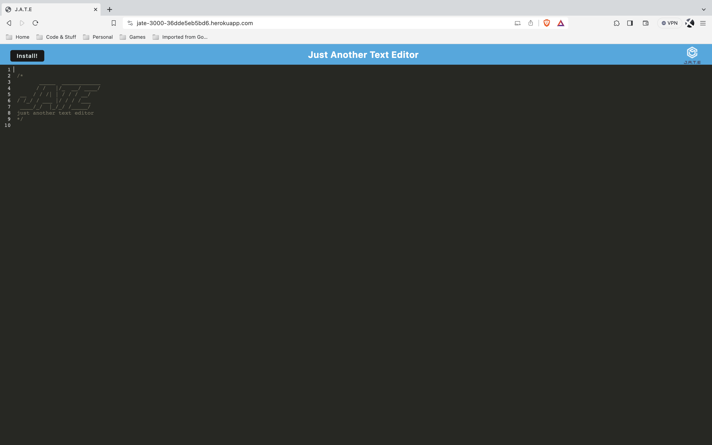
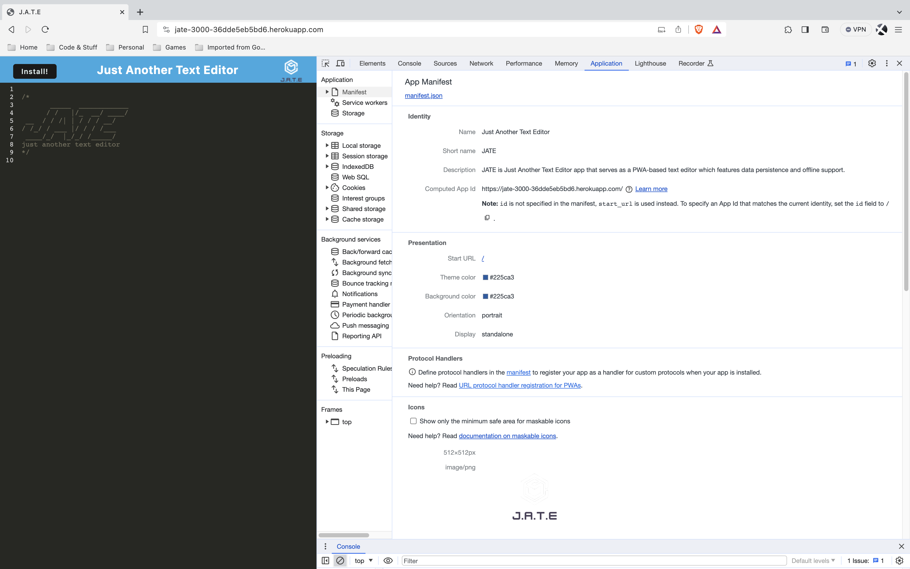
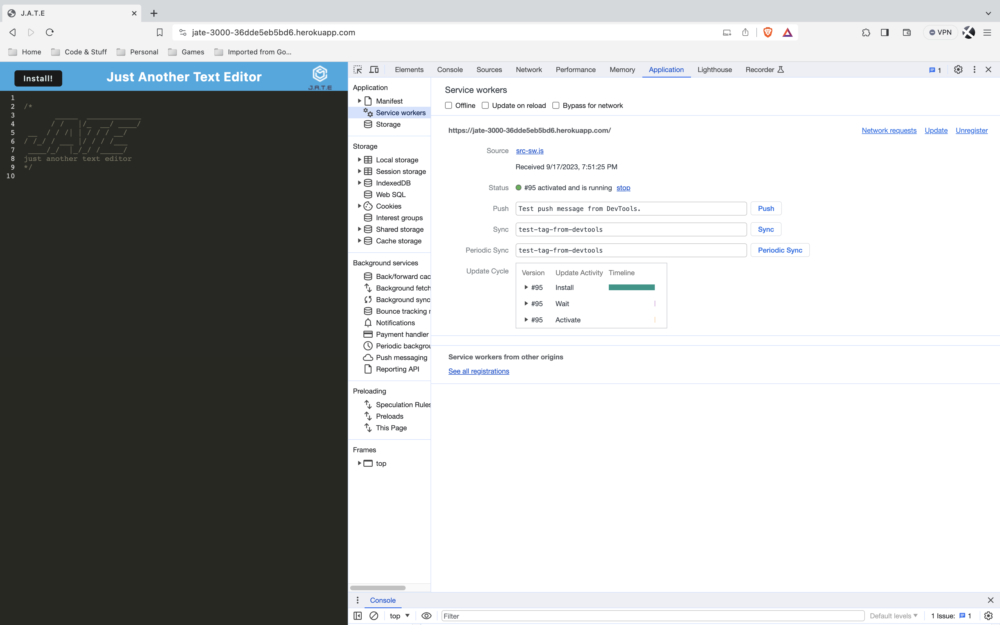
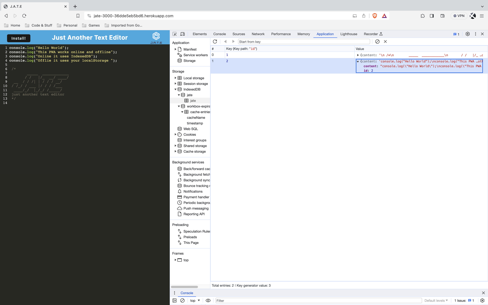

# J.A.T.E. [](./LICENSE)

***[J.A.T.E.](https://jate-3000-36dde5eb5bd6.herokuapp.com/)*** is a <ins> ***Just Another Text Editor*** </ins> app that runs in the browser. This app will be a single-page application that meets the PWA criteria. Additionally, it will feature a number of data persistence techniques that serve as redundancy in case one of the options is not supported by the browser. The application will also function offline.

## Table of Contents

- [Description](#description)
- [Tech Stack](#tech-stack)
- [Installation](#installation)
- [Usage](#usage)
- [Screenshots](#screenshots)
- [Links](#links)
- [License](#license)

## Description

```javascript
AS A developer
I WANT to create notes or code snippets with or without an internet connection
SO THAT I can reliably retrieve them for later use
```

[*back to top*](#table-of-contents)

## Tech Stack

- [](https://developer.mozilla.org/en-US/docs/Web/CSS)
- [](https://developer.mozilla.org/en-US/docs/Web/Guide/HTML/HTML5)
- [](https://developer.mozilla.org/en-US/docs/Web/JavaScript)
  - [](https://eslint.org/)
  - [](https://prettier.io/)
- [](https://nodejs.org/en)
  - [](https://docs.npmjs.com/cli/v10/)
    - [](https://www.npmjs.com/package/concurrently)
    - [](https://www.npmjs.com/package/@babel/core)

      - [](https://www.npmjs.com/package/babel-loader)
      - [](https://www.npmjs.com/package/@babel/preset-env)
      - [](https://www.npmjs.com/package/@babel/plugin-proposal-object-rest-spread)
      - [](https://www.npmjs.com/package/@babel/runtime)
      - [](https://www.npmjs.com/package/@babel/plugin-transform-runtime)

    - [](https://www.npmjs.com/package/express)
    - [](https://www.npmjs.com/package/http-server)
    - [](https://www.npmjs.com/package/html-webpack-plugin)
    - [](https://www.npmjs.com/package/idb)
    - [](https://www.npmjs.com/package/if-env)
    - [](https://www.npmjs.com/package/nodemon)
    - [](https://webpack.js.org/)
      - [](https://www.npmjs.com/package/code-mirror-themes)
      - [](https://www.npmjs.com/package/css-loader)
      - [](https://www.npmjs.com/package/style-loader)
      - [](https://www.npmjs.com/package/webpack-cli)
      - [](https://www.npmjs.com/package/webpack-dev-server)
      - [](https://www.npmjs.com/package/webpack-manifest-plugin)
      - [](https://www.npmjs.com/package/workbox-webpack-plugin)

[*back to top*](#table-of-contents)

## Installation

1. Packages to support this application can be installed by using [*npm install*](https://docs.npmjs.com/cli/v9/commands/npm-install) commands.

    > **Note**: If you do not have a `package.json` in your directory already, enter command below to [*initiate*](https://docs.npmjs.com/cli/v9/commands/npm-init).
    >
    > ```powershell
    > npm init -y
    > ```
  
2. **IMPORTANT**: Please configure each `package.json` in `root`, `server` and `client` directory with below critical `dependencies` and `scripts` prior to `npm install` to ensure proper functionality.

    **Root Directory `package.json`:**

    ```json
    {
      "main": "server.js",
      "engines": {
        "node": "20.6.1",
        "npm": "10.1.0 "
      },
      "scripts": {
        "start:dev": "concurrently \"cd server && npm run server\" \"cd client && npm run dev\"",
        "start": "npm run build && cd server && node server.js",
        "server": "cd server && nodemon server.js --ignore client",
        "build": "cd client && npm run build",
        "install": "cd server && npm i && cd ../client && npm i",
        "client": "cd client && npm start"
      },
      "dependencies": {
        "express": "^4.18.2",
        "if-env": "^1.0.4"
      },
      "devDependencies": {
        "concurrently": "^8.2.1",
        "nodemon": "^3.0.1"
      }
    }
    ```

   **Server Directory `package.json`:**

    ```json
    {
      "main": "server.js",
      "engines": {
          "node": "20.6.1",
          "npm": "10.1.0"
      },
      "scripts": {
          "server": "nodemon server.js --ignore client"
      },
      "dependencies": {
          "express": "^4.18.2"
      },
      "devDependencies": {
          "nodemon": "^3.0.1"
      }
    }
    ```

   **Client Directory `package.json`:**

    ```json
    {
      "engines": {
      "node": "20.6.1",
      "npm": "10.1.0"
      },
     "scripts": {
      "dev": "webpack-dev-server",
      "build": "webpack --mode production",
      "start": "webpack --watch"
      },
      "devDependencies": {
        "@babel/core": "^7.22.15",
        "@babel/plugin-transform-runtime": "^7.22.15",
        "@babel/plugin-proposal-object-rest-spread": "^7.20.7",
        "@babel/preset-env": "^7.22.15",
        "@babel/runtime": "^7.22.15",
        "babel-loader": "^9.1.3",
        "css-loader": "^6.8.1",
        "html-webpack-plugin": "^5.5.3",
        "http-server": "^14.1.1",
        "style-loader": "^3.3.3",
        "webpack": "^5.88.2",
        "webpack-cli": "^5.1.4",
        "webpack-dev-server": "^4.15.1",
        "webpack-pwa-manifest": "^4.3.0",
        "workbox-webpack-plugin": "^7.0.0"
      },
      "dependencies": {
        "code-mirror-themes": "^1.0.0",
        "core-js": "^3.32.2",
        "idb": "^6.1.2"
        }
    }
    ```

3. Once all the `package.json` files are properly configured, run the following command to install all dependencies:

    ```powershell
    npm install
    ```

[*back to top*](#table-of-contents)

## Usage

- This application can be invoked by using the following command:

    ```powershell
    npm start
    ```

- Workflow:

    ```js
    GIVEN a text editor web application
    WHEN I open my application in my editor
    THEN I should see a client server folder structure
    WHEN I run `npm run start` from the root directory
    THEN I find that my application should start up the backend and serve the client
    WHEN I run the text editor application from my terminal
    THEN I find that my JavaScript files have been bundled using webpack
    WHEN I run my webpack plugins
    THEN I find that I have a generated HTML file, service worker, and a manifest file
    WHEN I use next-gen JavaScript in my application
    THEN I find that the text editor still functions in the browser without errors
    WHEN I open the text editor
    THEN I find that IndexedDB has immediately created a database storage
    WHEN I enter content and subsequently click off of the DOM window
    THEN I find that the content in the text editor has been saved with IndexedDB
    WHEN I reopen the text editor after closing it
    THEN I find that the content in the text editor has been retrieved from our IndexedDB
    WHEN I click on the Install button
    THEN I download my web application as an icon on my desktop
    WHEN I load my web application
    THEN I should have a registered service worker using workbox
    WHEN I register a service worker
    THEN I should have my static assets pre cached upon loading along with subsequent pages and static assets
    WHEN I deploy to Heroku
    THEN I should have proper build scripts for a webpack application
    ```

[*back to top*](#table-of-contents)

## Screenshots

### Main Page


### Manifest File


### Service Worker


### IndexedDB


[*back to top*](#table-of-contents)

## Links

[](https://twitter.com/intent/tweet?text=Check%20out%20this%20Text%20Editor%20PWA%20on%20GitHub:%20https://github.com/Ronin1702/Text-Editor)

- GitHub Repo: [Text-Editor](https://github.com/Ronin1702/Text-Editor)
- Heroku App Deployed Link: [JATE-3000](https://jate-3000-36dde5eb5bd6.herokuapp.com/)

[*back to top*](#table-of-contents)

## License

- This application is licensed by [](./LICENSE).

[*back to top*](#table-of-contents)

---

[](https://kaichen.biz)
